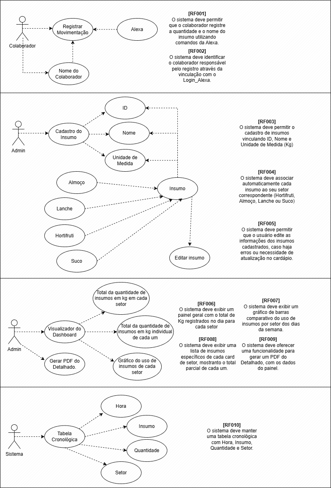
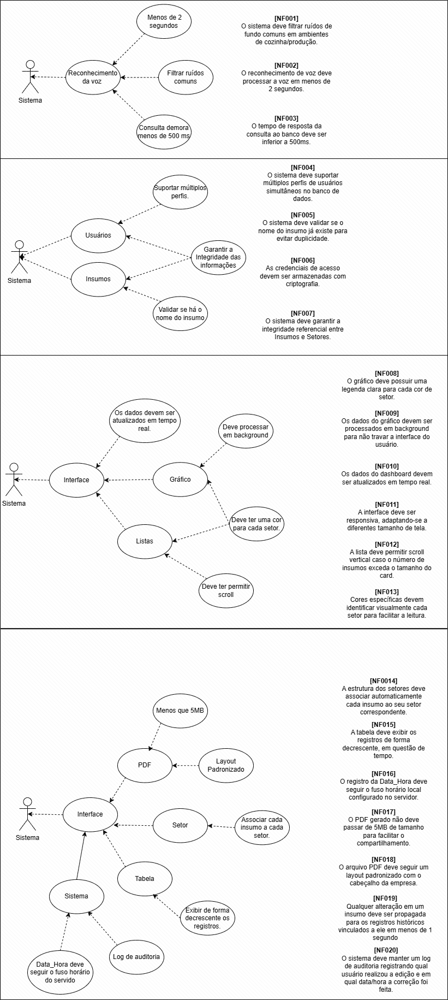

# Projeto Quinta Auxiliar
O projeto consiste em auxiliar as cozinheiras no registro do controle de estoque, a partir da fala, utilizando a Alexa. Relatos das funcionárias revelam que o registo em papel trava a rotina: o receio de perder dados em rascunhos molhados e o desgaste do retrabalho ao fim do turno geram um stresse constante. Esta burocracia manual rouba tempo que deveria ser focado exclusivamente na segurança e qualidade das refeições.
## Integrantes
- Gabriel Pereira de Oliveira
- Giovana Ferreira Remorini
- Giovana Luísa Cezar
- Kamilly Vitória Ferreira Silverio
## Requisitos
### Requisitos Funcionais
[RF001] O sistema deve permitir que o colaborador registre a quantidade e o nome do insumo utilizando comando da Alexa.

[RF002] O sistema deve identificar o colaborador responsável pelo registro através da vinculação com o Login_Alexa.

[RF003] O sistema deve permitir o cadastro de insumos vinculando ID, Nome e Unidade de Medida (Kg)

[RF004] O sistema deve associar automaticamente cada insumo ao seu setor correspondente (Hortifruti, Almoço, Lanche ou Suco).

[RF005] O sistema deve permitir que o usuário edite as informações dos insumos cadastrados, caso haja erros ou necessidade de atualização do cardápio.

[RF006] O sistema deve exibir um painel geral com o total de Kg registrados no dia para cada setor.

[RF007] O sistema deve exibir um gráfico de barras comparativo do uso de insumos por setor dos dias da semana.

[RF008] O sistema deve exibir uma lista de insumos específicos de cada card de setor, mostrando o total parcial de cada um.

[RF009] O sistema deve oferecer uma funcionalidade para gerar um PDF do Detalhado, com os dados do painel.

[RF010] O sistema deve manter uma tabela cronológica com Hora, Insumo, Quantidade e Setor.

### Requisitos Não Funcionais
[NF001] O sistema deve filtrar ruídos de fundo comuns em ambientes de cozinha/produção.

[NF002] O reconhecimento de voz deve processar a voz em menos de 2 segundos.

[NF003] O tempo de resposta da consulta ao banco deve ser inferior a 500ms.

[NF004] O sistema deve suportar múltiplos perfis de usuário simultâneos no banco de dados.

[NF005] O sistema deve validar se o nome do insumo já existe para evitar duplicidade.

[NF006] As credenciais de acesso devem ser armazenadas com criptografia.

[NF007] O sistema deve garantir a integridade referencial entre Insumos e Setores.

[NF008] O gráfico deve possuir uma legenda clara para cada cor de setor.

[NF009] Os dados do gráfico devem ser processados em background para não travar a interface do usuário.

[NF010] Os dados do dashboard devem ser atualiazados em tempo real.

[NF011] A interface deve ser responsiva, adaptando-se a diferentes tamanhos de tela.

[NF012] A lista deve permitir scroll vertical caso o número de insumos exceda o tamanho do card.

[NF013] Cores específicas devem identificar visualmente cada setor para facilitar a leitura.

[NF014] A estrutura dos setores deve associar automaticamente cada insumo ao seu setor correspondente.

[NF015] A tabela deve exibir os registros de forma decrescente, em questão de tempo.

[NF016] O registro da Data_Hora deve seguir o fuso horário local configurado no servidor.

[NF017] O PDF gerado não deve passar de 5MB de tamanho para facilitar o compartilhamento.

[NF018] O arquivo PDF deve seguir um layout padronizado com o cabeçalho da empresa.

[NF019] Qualquer alteração em um insumo deve ser propagada para os registros históricos vinculados a ele em menos de 1 segundo.

[NF20] O sistema deve manter um log de autoria registrando qual usuário realizou a edição e em qual data/hora a correção foi feita.
## Diagrama de Casos de Uso

Nessa imagem, observamos os diagramas envolvendo os Requisitos Funcionais.

 

Nessa, vemos os diagramas envolvendo os Requisitos Não Funcionais.

## Protótipo
O protótipo pode ser acessado apartir desse [site](https://vestuarioaxel.my.canva.site/quintaauxiliar/)
